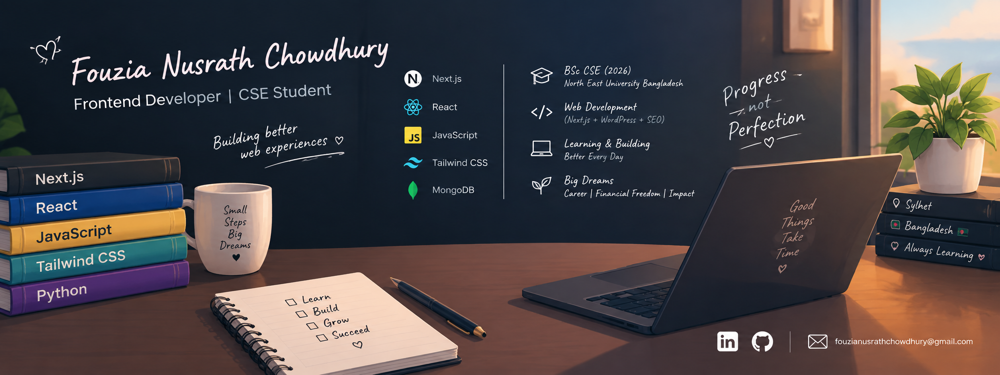

  

<h1 align="center">Hi, I'm Nusrath Chowdhury 👋</h1>

  <strong>CSE Graduate • Software Developer in Progress • ML/NLP Researcher</strong>

  Currently learning, building, and improving my skills in 
  <strong>Software Development, Web Development, and Machine Learning</strong>.

  
  
  

---

## 👩‍💻 About Me

* 🎓 CSE Graduate from **North East University Bangladesh**
* 💻 Currently learning and growing as a **Software Developer**
* 🌐 Interested in **Web Development and Software Engineering**
* ⚛️ Building projects with **React, Next.js, TypeScript, and Tailwind CSS**
* 🧩 Currently improving my **JavaScript problem-solving skills**
* 🤖 Background in **Machine Learning, Deep Learning, and NLP**
* 🌾 Working on research related to **Bangla crop disease detection**
* 📚 Learning through projects, coding practice, and continuous development
* 🚀 My goal is to build useful, reliable, and real-world software

---

## 🛠️ What I'm Currently Learning

`JavaScript` • `TypeScript` • `React` • `Next.js` • `Node.js` •
`Data Structures & Algorithms` • `Problem Solving` • `Git & GitHub`

---

## 💻 Tech Stack

### 🌐 Frontend

  

### ⚙️ Backend & Database

  

### 🤖 Machine Learning & Data

  

  
  
  
  

### 🧰 Tools

  

---

## 🚀 Featured Projects

### 🏋️ FitLog

A modern workout library and workout planning application built while practicing **Next.js, React, TypeScript, Tailwind CSS, and API integration**.

**Technologies:**
`Next.js` `React` `TypeScript` `Tailwind CSS` `API`

---

### 📚 Book Vibe

A book discovery and reading-list application built with **Next.js and React**, including book details, reading lists, wishlist functionality, and shared application state.

**Technologies:**
`Next.js` `React` `Context API` `Dynamic Routes` `JSON`

---

### 🌾 Bangla CropAssist

**Bangla CropAssist: Symptom-Based Multi-Crop Disease Detection with Treatment Guidance**

A research project focused on identifying crop diseases from Bangla symptom descriptions and providing treatment guidance.

**Technologies:**
`Bangla NLP` `BanglaBERT` `LSTM` `Machine Learning` `Deep Learning`

---

## 📊 GitHub Overview

  

  
  

---

## 📈 GitHub Statistics

  
  

---

## 🔥 Contribution Activity

  

---

## 📦 GitHub Activity

  

  

---

## 🎯 My 2026 Goals

* 🚀 Grow as a Software Developer
* 💻 Build more real-world projects
* 🧩 Improve problem-solving and DSA skills
* ⚛️ Become stronger with React and Next.js
* 🔧 Improve backend development skills
* 🌱 Start contributing to open-source projects
* 📚 Continue learning Machine Learning and NLP
* 🛠️ Build a stronger GitHub portfolio

---

## 📫 Let's Connect

  

  

  

  <i>Learning • Building • Improving • One project at a time 🚀</i>

